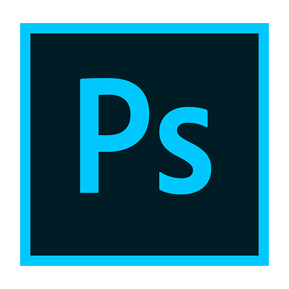
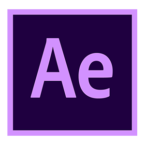

### HI THERE !

<h1>Tahsin Abrar</h1>

- 📫 E-mail : **towahatahsin01@gmail.com**

##  **About Me:**

- I have been working in the online marketplace for the past **five years** Also,
- have great experience in the **local market**. 
- I am designed everything from logos to graphics related.
- I always like working in **Visual Studio Code** Environment.
- I'm a knowledge seeker & I love to learn new 💻 **Technologies**.

 

### Connect with me:

### Languages and Tools:

 

 **Github Stats:**

  
📊 Github Readme Stats

  
 

  
  
 

   

